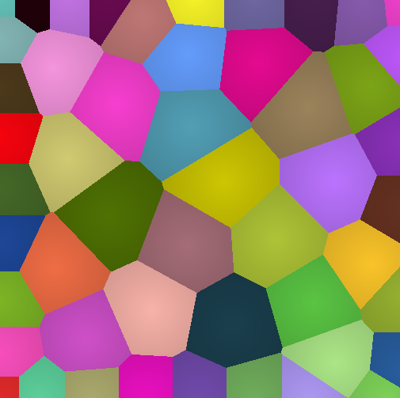
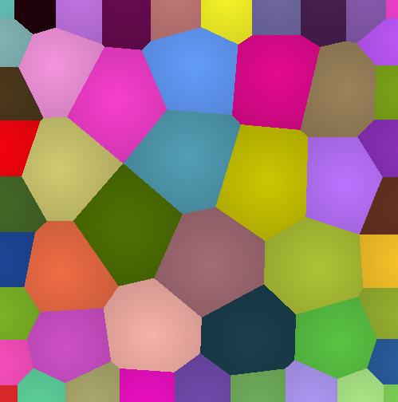

# Voronoi pattern

Simple OpenGL voronoi cells patterns. Each cell moves away from others, which leads to quite uniform pattern over time.

Dependencies:
- [GLFW](https://www.glfw.org/)
- [glm](https://glm.g-truc.net/0.9.9/index.html)

